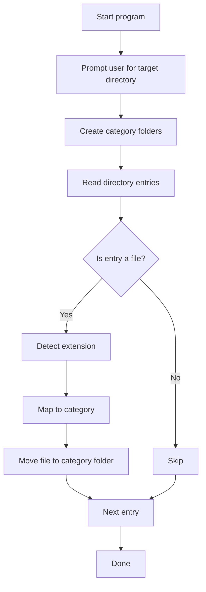

# File Organiser

A lightweight Rust CLI that sorts files in a target directory into clean category folders based on file extension.

[](https://www.rust-lang.org/)
[](#)
[](LICENSE)

## Overview

`file_organiser` helps you declutter a folder by automatically moving files into:

- `Images`
- `Videos`
- `Documents`
- `Others`

The tool scans the chosen directory, identifies each file type from its extension, and moves each file into the matching category.

## Features

- Simple interactive command-line experience
- Automatic category folder creation
- Extension-based file classification
- Case-insensitive extension matching
- Ignores non-file entries during move operations
- Written in pure Rust with no external dependencies

## How It Works



## Extension Mapping

| Category | Extensions |
|---|---|
| Images | `jpg`, `jpeg`, `png`, `gif`, `bmp`, `webp`, `svg` |
| Videos | `mp4`, `mkv`, `avi`, `mov`, `wmv`, `flv`, `webm` |
| Documents | `pdf`, `doc`, `docx`, `txt`, `rtf`, `ppt`, `pptx`, `xls`, `xlsx`, `csv`, `odt` |
| Others | Anything not listed above |

## Project Structure

```text
file_organiser/
├── Cargo.toml
├── README.md
└── src/
    └── main.rs
```

## Requirements

- Rust toolchain (latest stable recommended)
- Cargo (comes with Rust)

Install Rust from: <https://www.rust-lang.org/tools/install>

## Build

```bash
cargo build
```

For optimized release build:

```bash
cargo build --release
```

## Run

```bash
cargo run
```

You will be prompted:

```text
Enter the directory path to organise:
```

Provide an absolute or relative path to the folder you want to organize.

## Example

Before:

```text
Downloads/
├── holiday.jpg
├── movie.mp4
├── notes.txt
└── archive.zip
```

After running:

```text
Downloads/
├── Documents/
│   └── notes.txt
├── Images/
│   └── holiday.jpg
├── Others/
│   └── archive.zip
└── Videos/
    └── movie.mp4
```

## Current Behavior Notes

- The program creates `Images`, `Videos`, `Documents`, and `Others` folders every run.
- Moving is performed with `std::fs::rename`.
- Files are organized only at the top level of the chosen directory.
- Existing directories/subfolders are skipped during move iteration.

## Known Limitations

- If category folders already exist, creation may fail in current implementation.
- If a destination file with the same name already exists, move may fail.
- The input path is currently taken directly from user input without extra sanitization.
- There is no dry-run mode or undo operation yet.

## Roadmap Ideas

- Add robust path trimming and validation
- Handle already-existing target folders gracefully
- Support nested directory traversal (recursive mode)
- Add collision handling (`file (1).ext` style)
- Add `--dry-run` and `--verbose` flags
- Add tests for classification and file movement logic

## Development

Format and lint:

```bash
cargo fmt
cargo clippy -- -D warnings
```

Run tests:

```bash
cargo test
```

## License

MIT (recommended). Add a `LICENSE` file to formalize project licensing.

---

Built with Rust to keep file management fast, safe, and maintainable.
